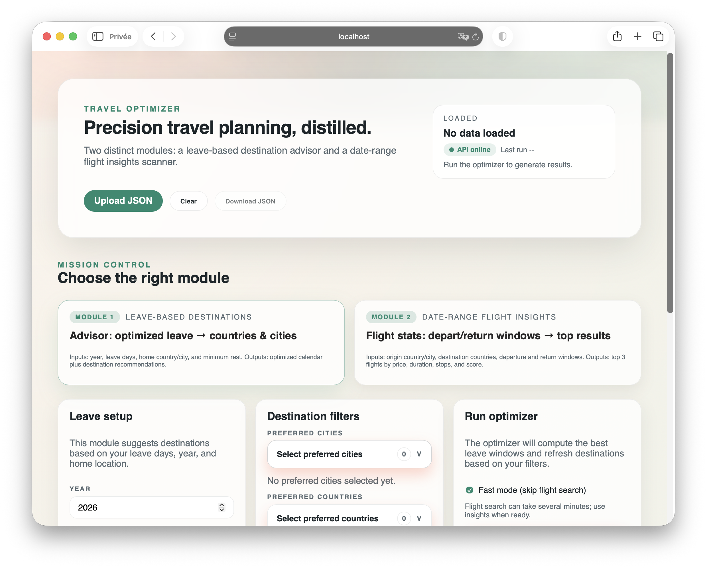

# Travel Optimizer

Unified pipeline for timeoff planning, destination suggestions, flight selection, lodging scoring, and itinerary building.



## Quickstart

Install dependencies:

```bash
make deps
```

Run the app:

```bash
make dev
```

Open `http://localhost:5173` to use the UI. The optimizer and flight insights run from the API behind the scenes.

## Run with uv

CLI:

```bash
uv run travel-optimizer --year 2025 --leave 25 --min-rest 3
```

API only:

```bash
uv run uvicorn travel_optimizer.api.app:app --reload --port 8000
```

## Web UI (TypeScript)

The modern dashboard lives in `web/`. It can call the local API directly or load a JSON file.

```bash
make web-dev
```

## Optional Redis/Celery queue

Use this when you want a persistent job queue and background workers (recommended for production). By default the API uses the in-memory queue.

Install the extra dependencies:

```bash
uv sync --extra queue
```

Start Redis and run a worker:

```bash
export TRAVEL_OPTIMIZER_QUEUE_BACKEND=celery
export CELERY_BROKER_URL=redis://localhost:6379/0
export CELERY_RESULT_BACKEND=redis://localhost:6379/1
export TRAVEL_OPTIMIZER_REDIS_URL=redis://localhost:6379/2
make celery-worker
```

Then launch the API and UI as usual. The UI queue tab will read from Redis-backed jobs.

## Professional workflow

- Tooling is pinned via `.python-version` and `.node-version`.
- Python deps are locked with `uv.lock`; web deps are locked via `web/package-lock.json`.
- Use `make deps` to install both environments.
- Use `make bootstrap` to install deps and generate map data.
- `make audit` runs `npm audit` and `uv pip check`.
- `make clean` removes virtual envs, node_modules, build artifacts, and cache outputs.
- `make dev` starts the API and UI together (pipeline runs when triggered from the UI).
- Use `make dev PIPELINE=1` to generate `outputs/reports/pipeline.json` at startup.
- Use `make dev API=0` to launch the UI without the API.
- `make map-data` regenerates `web/public/airports.json` for the map layer.

## Project layout

- `src/travel_optimizer/`: core package
- `data/`: datasets (raw/processed/cache)
- `outputs/`: generated reports and itineraries
- `tests/`: unit and integration tests

## Notes

- Timeoff optimization uses the `holidays` package for country calendars (coverage depends on supported countries/subdivisions).
- Flight insights use `flight_planner.py` and may require network access and extra time.
- Flight fetch defaults to `local`. Use `TRAVEL_OPTIMIZER_FLIGHT_FETCH_MODE=auto` to try `common` then `local`.
- Set `TRAVEL_OPTIMIZER_PATCH_LOCAL_PLAYWRIGHT=1` only if you need the custom Playwright fetcher.
- Normalization defaults can be overridden via `TRAVEL_OPTIMIZER_LOCALE` (`fr-FR`), `TRAVEL_OPTIMIZER_TIMEZONE` (`Europe/Paris`), `TRAVEL_OPTIMIZER_CURRENCY` (`EUR`).
